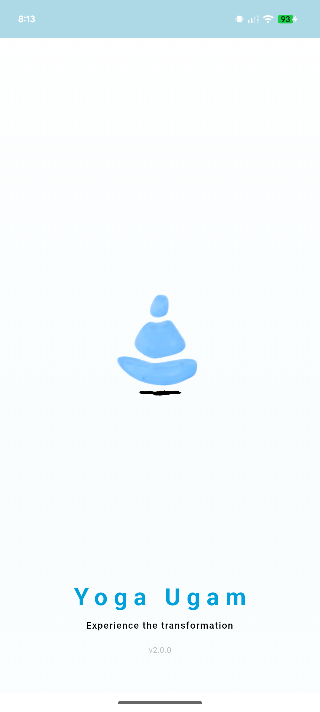
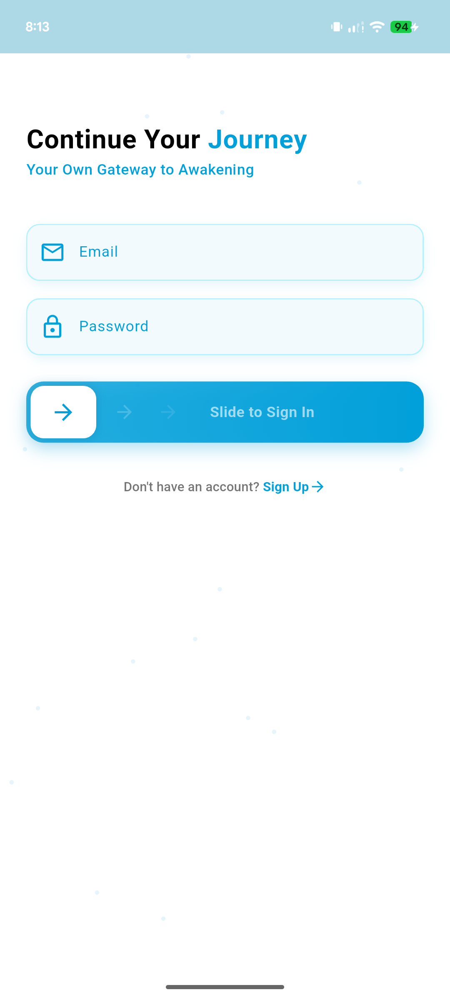
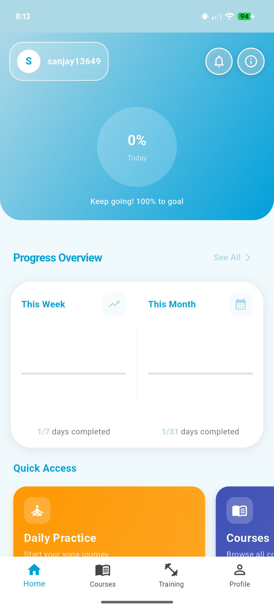
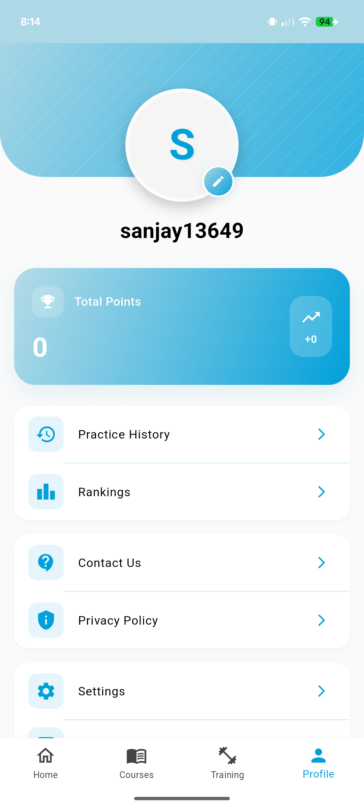
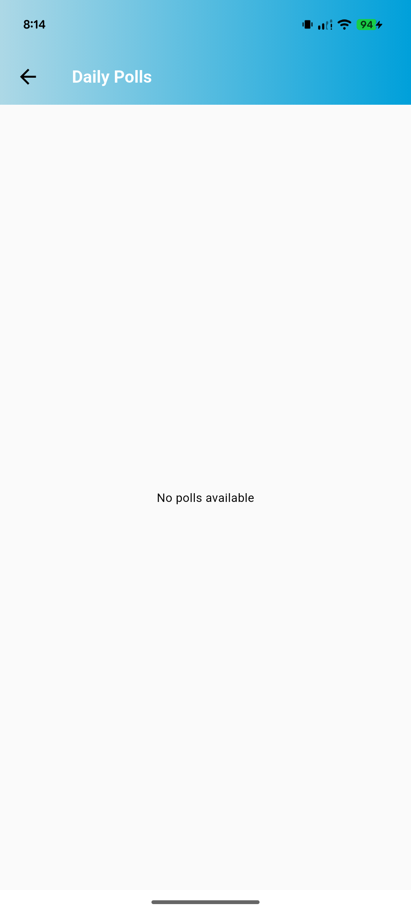

<p align="center">
  
</p>

<h1 align="center">🧘‍♂️ Yoga Yugam</h1>
<p align="center">
  <b>Find your balance. Breathe. Stretch. Grow.</b><br>
  <i>A modern, cross-platform Flutter app for every yogi.</i>
</p>

<div align="center">

[](https://flutter.dev)
[](https://dart.dev)
[](https://firebase.google.com)

</div>

---

## ✨ Why Yoga Yugam?

Welcome to **Yoga Yugam** – your personal yoga studio in your pocket!  
Whether you're a beginner or a seasoned yogi, our app helps you master poses, track progress, and stay motivated.  
**Unroll your mat, and let's flow!**

---

## 🚀 Features

<table>
<tr>
<td>

🧘‍♀️ **Guided Yoga Sessions**  
Step-by-step flows for all levels.

📹 **Animated Pose Demonstrations**  
Learn with smooth, clear animations.

📅 **Personalized Schedules & Reminders**  
Never miss a session.

🌙 **Light & Dark Themes**  
Practice day or night, your way.

</td>
<td>

📈 **Progress Tracking**  
See your growth, celebrate milestones.

🔔 **Push Notifications**  
Gentle nudges to keep you on track.

🏆 **Achievements & Badges**  
Unlock rewards as you grow.

📊 **Monthly Analytics**  
Track your yoga journey over time.

</td>
</tr>
</table>

---

## 📸 Screenshots

<p align="center">
  
  
  
  
</p>

<p align="center">
  
  
  
  
</p>

<p align="center">
  <i>Splash • Login • Home • Courses • Settings • History • Polls • Monthly</i>
</p>

---

## 🛠️ Tech Stack

| Technology | Purpose |
|------------|---------|
| **Flutter** (Dart) | Beautiful, fast, cross-platform development |
| **Provider** | Effortless state management |
| **Firebase** (optional) | Cloud sync & backend services |
| **Custom Animations** | Smooth, delightful UI transitions |

---

## 📦 Folder Structure

```
yoga/
├── 📁 android/
├── 📁 ios/
├── 📁 lib/
│   ├── 📄 main.dart
│   ├── 📁 models/
│   ├── 📁 screens/
│   ├── 📁 widgets/
│   └── 📁 services/
├── 📁 assets/
│   ├── 📁 images/
│   └── 📁 animations/
├── 📁 test/
└── 📄 pubspec.yaml
```

---

## ⚡ Getting Started

### Prerequisites
- Flutter SDK (latest stable version)
- Dart SDK
- Android Studio / VS Code
- Git

### Installation Steps

**1.** Clone the repository
```bash
git clone https://github.com/yourusername/yoga-app-final-flutter.git
cd yoga
```

**2.** Install dependencies
```bash
flutter pub get
```

**3.** Run the app
```bash
flutter run
```

### Additional Setup (Optional)

**For Firebase Integration:**
```bash
# Install Firebase CLI
npm install -g firebase-tools

# Login to Firebase
firebase login

# Initialize Firebase in your project
firebase init
```

---

## 🎯 App Screens Overview

| Screen | Description |
|--------|-------------|
| **Splash** | Welcome screen with app branding |
| **Login** | User authentication and registration |
| **Home** | Dashboard with quick access to features |
| **Courses** | Browse and select yoga programs |
| **Settings** | App preferences and user profile |
| **History** | Track your completed sessions |
| **Polls** | Community engagement and feedback |
| **Monthly** | Monthly progress and analytics |

---

## 📝 Contributing

We welcome contributions! Here's how you can help:

1. **Fork** the repository
2. **Create** your feature branch (`git checkout -b feature/AmazingFeature`)
3. **Commit** your changes (`git commit -m 'Add some AmazingFeature'`)
4. **Push** to the branch (`git push origin feature/AmazingFeature`)
5. **Open** a Pull Request

### Development Guidelines
- Follow Flutter best practices
- Write meaningful commit messages
- Add tests for new features
- Update documentation as needed

---

## 🐛 Bug Reports & Feature Requests

Found a bug or have a feature request? Please create an issue on our GitHub repository.

**Bug Report Template:**
- Device information
- Steps to reproduce
- Expected vs actual behavior
- Screenshots (if applicable)

---

## 📄 License

This project is licensed under the MIT License - see the [LICENSE](LICENSE) file for details.

---

## 📚 Resources & Documentation

<div align="center">

| Resource | Link |
|----------|------|
| **Flutter Documentation** | [docs.flutter.dev](https://docs.flutter.dev/) |
| **Dart Language Tour** | [dart.dev/guides](https://dart.dev/guides/language/language-tour) |
| **Firebase for Flutter** | [firebase.flutter.dev](https://firebase.flutter.dev/) |
| **Material Design** | [material.io](https://material.io/) |

</div>

---

## 🌟 Support

If you like this project, please consider:
- ⭐ Starring the repository
- 🐛 Reporting bugs
- 💡 Suggesting new features
- 📢 Sharing with the community

---

## 👥 Team

<p align="center">
  <b>Built with dedication by the Yoga Yugam team</b>
</p>

---

<p align="center">
  <i>Made with ❤️ and <b>Flutter</b>.<br>
  <b>Namaste 🙏</b></i>
</p>

<p align="center">
  
  
</p>